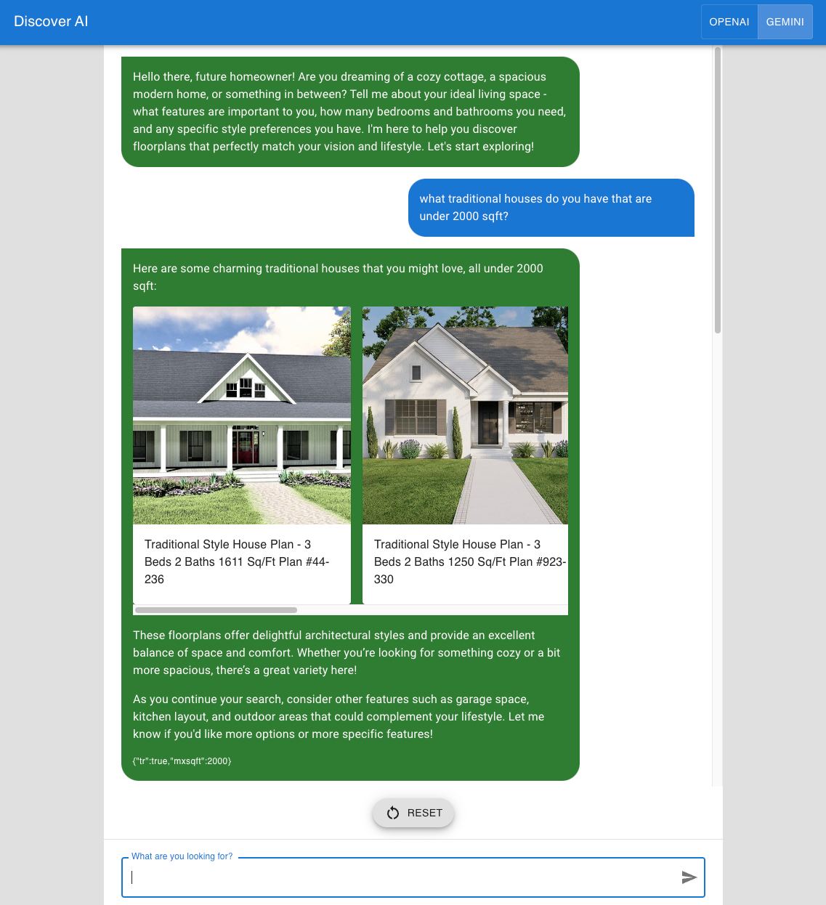

# Discover AI

**Reimagine search. Converse with AI. Discover anything.**

_Discover AI_ is a proof-of-concept, versatile chat-based app that I built to let users explore diverse content (tech products, floor plans, and more) using natural language. It provides an intuitive and conversational way to search for information, making it easy for users to find what they want. The idea is that a company could use this type of AI technology to provide their customers a more engaging and personalized search experience.

The app supports both [Google Gemini AI](https://ai.google.dev/) ([Gemini 1.5 Pro](https://deepmind.google/technologies/gemini/pro/)) and [OpenAI](https://platform.openai.com/) ([GPT-4o mini](https://openai.com/index/gpt-4o-mini-advancing-cost-efficient-intelligence/)) models, leveraging AI function calling to transform user requests and questions into relevant results with rich media and providing informative summaries explaining why items were chosen. Its flexible architecture allows for easy integration of new content types via search APIs.

## Table of Contents

- [Key Features](#key-features)
- [Screenshots](#screenshots)
- [Tools & Technologies](#tools--technologies)
- [Technical Overview](#technical-overview)
- [Future Plans](#future-plans)
- [Demo Video](#demo-video)
- [Running it Locally](#running-it-locally)
- [License](#license)
- [Acknowledgments](#acknowledgments)
- [Disclaimer](#disclaimer)

## Key Features

- **Conversational Search:** Interact with AI using natural language queries, just like talking to an expert.
- **Powered by Gemini AI & OpenAI:** Leverages advanced AI capabilities for natural language understanding and contextual search.
- **AI Function Calling:** Seamlessly integrates with various search APIs, transforming user requests into actionable insights.
- **Rich Media Results:** Presents search results in visually appealing and informative cards, including images, prices, and direct links.
- **Informative Summaries:** Provides explanations alongside results, helping users understand the AI's reasoning and choices.
- **Flexible Architecture:** Easily integrates new content types via search APIs, expanding its potential for future growth.
- **Accessibility:** Supports voice-to-text input, making information discovery inclusive for everyone.

## Demo Video

View the [3-minute video](https://www.youtube.com/watch?v=z44LJRgyN1E) to see _Discover AI_ and its key features in action:

[](https://www.youtube.com/watch?v=z44LJRgyN1E)

## Screenshots



## Tools & Technologies

- [Gemini API](https://ai.google.dev/gemini-api/)
- [OpenAI API](https://openai.com/api/)
- [Next.js](https://nextjs.org/)
- [MUI Material UI](https://mui.com/material-ui/)
- [Zustand](https://docs.pmnd.rs/zustand/)
- [Kaggle datasets](https://www.kaggle.com/)
- [Best Buy API](https://developer.bestbuy.com/)
- [House Plans](https://www.houseplans.com/)
- [Google Books API](https://developers.google.com/books)

## Technical Overview

_Discover AI_ is built on a modular and extensible architecture designed to accommodate multiple AI models and diverse content sources. Currently, it supports both Google's Gemini AI and OpenAI models, providing users with the flexibility to choose their preferred AI engine.

The app leverages Next.js for its frontend framework, MUI Material UI for styling, and Zustand for efficient state management. It utilizes AI function calling to seamlessly interact with a variety of search APIs, including Best Buy, House Plans, and Google Books. Additionally, Kaggle datasets are incorporated to power the fashion search functionality.

The architecture is designed for easy integration of new content sources. Adding a new data source typically involves the following steps:

1. [**System Instructions**](./src/app/api/floorplans/constants.ts): Define clear and concise system instructions to guide the AI's behavior and understanding of the specific content domain.
2. [**Function Parameters**](./src/app/api/floorplans/functions.ts): Specify the necessary function parameters to enable effective communication with the corresponding search API.
3. [**Search & Retrieval**](./src/app/api/floorplans/plans.ts): Implement the core search and item details retrieval functionalities to fetch and process data from the API.
4. [**SDK (If Needed)**](./src/app/api/sdks/houseplans.ts): Develop an SDK to streamline interactions with the API and handle any specific data transformations.
5. [**UI Integration**](./src/app/api/floorplans/route.ts): Connect the content page UI components to the backend API route to display the retrieved data and rich media elements.

This modular approach allows for rapid expansion of _Discover AI_'s capabilities, enabling it to adapt to a wide range of search and discovery needs.

## Future Plans

My primary focus for _Discover AI_ is to significantly increase the breadth and differentiation of content sources it supports. By integrating a wider variety of APIs, I aim to empower users to explore diverse domains, including:

- Entertainment & Media (movies, TV shows, music, podcasts)
- Travel & Hospitality (flights, hotels, attractions, restaurants)
- E-commerce & Local Businesses (products, services, reviews)
- Real Estate & Home Improvement (properties, floor plans, DIY resources)
- Knowledge & Learning (educational content, research, news)

This expansion will demonstrate _Discover AI_'s position as a versatile and comprehensive search platform, catering to a wide range of user interests and needs. Additionally, I plan to continue refining the conversational flow and user experience, ensuring seamless and intuitive interactions across all content types.

## Running it Locally

> NOTE: To conserve my OpenAI/Gemini tokens budget, the app is currently not publicly hosted. You'll need to run it locally to experience its functionality.

After [cloning the repository](https://docs.github.com/en/repositories/creating-and-managing-repositories/cloning-a-repository), install the dependencies with [pnpm](https://pnpm.io/):

```bash
pnpm install
```

Copy the `.env.local.example` to `.env.local` file with your AI API keys ([OpenAI API key](https://help.openai.com/en/articles/4936850-where-do-i-find-my-api-key) & [Gemini API key](https://ai.google.dev/gemini-api/docs/api-key)). Specific data sources require API keys as well.

Run the local development server:

```bash
pnpm run dev
```

Open [http://localhost:3333](http://localhost:3333) with your browser to see the app in action. You'll be able to start communicating with the AI expert through the chat interface and explore the diverse content sources available.

## License

This project is licensed under the MIT License - see the [LICENSE.md](./LICENSE.md) file for details. The code is provided for instructional purposes. Please do not copy or redistribute the app without explicit permission.

## Acknowledgments

I'd like to thank Google for providing access to the Gemini AI API and OpenAI for access to their GPT models through their respective AI APIs. These powerful tools have been instrumental in making _Discover AI_ possible, enabling me to explore the potential of AI-powered search and create a more intuitive and personalized user experience.

## Disclaimer

Please note that Discover AI is a work in progress and may contain bugs or limitations. I appreciate your feedback and suggestions as I continue to improve the app.
