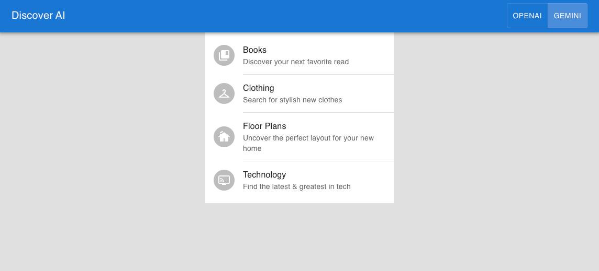

# Discover AI

A proof-of-concept AI-powered chatbot that helps users browse through a variety of organizations' data (such as clothes, tech products, etc) to enable discovery through text-based conversation. It uses the [Open AI](https://platform.openai.com/) & [Google Gemini](https://ai.google.dev/) APIs.



## Getting Started

After cloning the repository, install the dependencies with [pnpm](https://pnpm.io/):

```bash
pnpm install
```

Copy the `.env.local.example` to `.env.local` file with your AI API keys ([OpenAI API key](https://help.openai.com/en/articles/4936850-where-do-i-find-my-api-key) & [Gemini API key](https://ai.google.dev/gemini-api/docs/api-key)):

Run the local development server:

```bash
pnpm run dev
```

Open [http://localhost:3000/bestbuy](http://localhost:3000/bestuy) with your browser to see the result.
