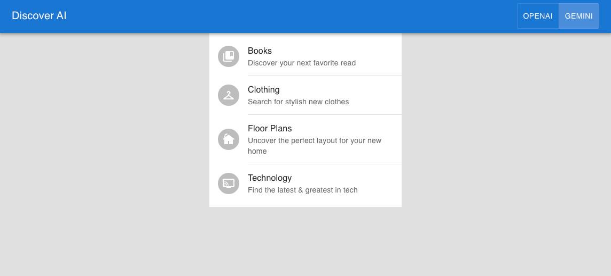

# Discover AI

Discover AI is a proof-of-concept, versatile chat-based app that lets users explore diverse content (tech products, floor plans, and more) using natural language. It provides an intuitive and conversational way to search for information, making it easy for users to find what they're looking for. The app supports both [Google Gemini AI](https://ai.google.dev/) and [OpenAI](https://platform.openai.com/) models, leveraging AI function calling to transform user requests and questions into relevant results with rich media and providing informative summaries explaining why items were chosen. Its flexible architecture allows for easy integration of new content types via search APIs.




## Getting Started

After cloning the repository, install the dependencies with [pnpm](https://pnpm.io/):

```bash
pnpm install
```

Copy the `.env.local.example` to `.env.local` file with your AI API keys ([OpenAI API key](https://help.openai.com/en/articles/4936850-where-do-i-find-my-api-key) & [Gemini API key](https://ai.google.dev/gemini-api/docs/api-key)):

Run the local development server:

```bash
pnpm run dev
```

Open [http://localhost:3000](http://localhost:3000) with your browser to see the result.
